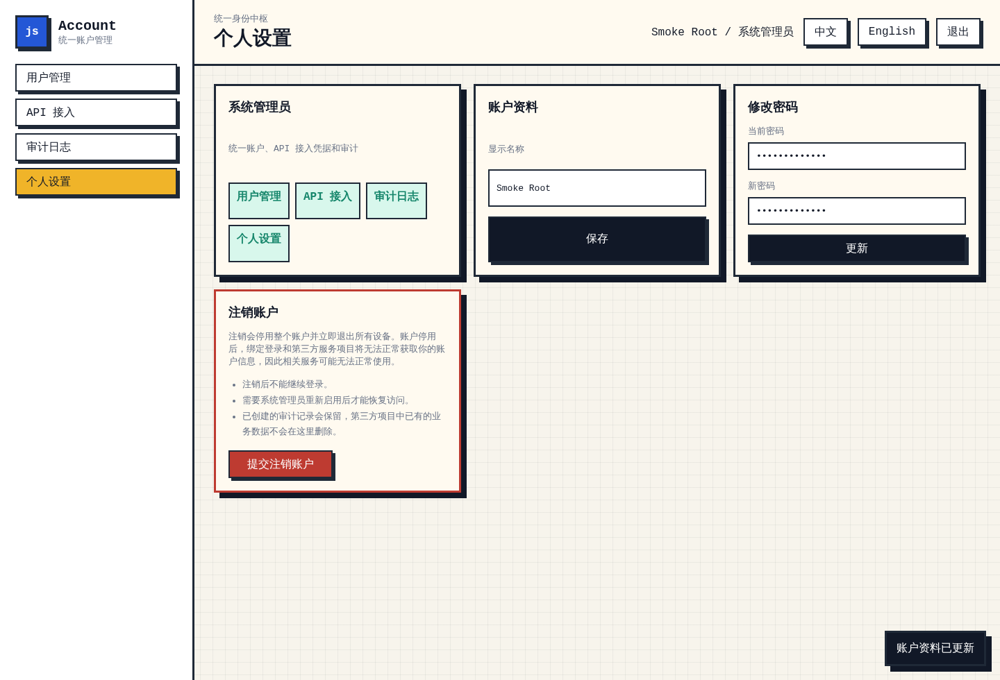

# Account System

`account-system` is the unified JS.Gripe account center. It manages users, browser sessions, API clients, third-party authorization, identity binding, and audit logs.

It does not manage business data for `dquery`, `myfiles`, blogs, picture storage, DNS rules, uploads, or files. Business services store account-system `user.id` as their owner key and manage their own data.

This repository is v2-only. Legacy database schemas, prefixed IDs, and pre-v2 callback-token SSO are intentionally not preserved.

Current production shape:

- Web console: `https://account.js.gripe`
- API base: `https://gateway.js.gripe/api/v1/myaccount`
- Runtime: Node.js 20+
- Database: SQLite
- Frontend: static HTML/CSS/JS in `public/`
- Sessions: bearer tokens stored by the web app, with expiration in SQLite
- Entity IDs: UUIDv7 without legacy prefixes
- Reverse proxy: OpenResty

## Roles

| Role | Purpose |
| --- | --- |
| `system_admin` | Full account, API client, and audit administration |
| `operator` | User operations such as create, disable, role update, identity reset |
| `auditor` | Read-only audit access |
| `member` | Own account settings |

The first user is created through `/login` setup when the database is empty and becomes `system_admin`.

## Main Paths

```text
src/server.mjs              HTTP server and API routing
src/store.mjs               SQLite store and permission logic
public/login.html           setup/login/register/third-party authorization UI
public/dashboard.html       account console
public/app.js               frontend behavior
public/styles.css           pixel UI styles
scripts/db-check.mjs        SQLite integrity check
tests/                      node --test coverage
```

## Environment

Common production environment:

```bash
ACCOUNT_HOST=127.0.0.1
ACCOUNT_PORT=9100
ACCOUNT_BASE_PATH=/api/v1/myaccount
ACCOUNT_ALLOWED_ORIGIN=https://account.js.gripe
ACCOUNT_DB_PATH=/opt/account-system/data/accounts.sqlite3
ACCOUNT_PUBLIC_DIR=/opt/account-system/public
```

Static cache policy:

- `login.html`, `dashboard.html`, and JavaScript are `no-store`.
- Login/dashboard resource references include a version query string.
- Other static assets may be cached briefly.

## Run

```bash
cd /opt/account-system
npm start
```

Production service:

```bash
systemctl status account-system.service
journalctl -u account-system.service -f
```

## Test

```bash
cd /opt/account-system
npm test
ACCOUNT_DB_PATH=/opt/account-system/data/accounts.sqlite3 npm run db:check
```

## First Install

The first install is intentionally gated. Old databases can be deleted or rebuilt; v2 does not migrate legacy schemas.

1. Generate the bootstrap token on the server:

```bash
cd /opt/account-system
npm run bootstrap:token
```

The command displays the one-time install token in the terminal and writes `ACCOUNT_BOOTSTRAP_TOKEN_HASH` plus `ACCOUNT_DB_PATH` to `/opt/account-system/config/account-system.env`. Do not copy the displayed token into README, tickets, chat, or logs.

2. Ensure the service reads the generated config file:

```text
EnvironmentFile=-/opt/account-system/config/account-system.env
```

3. Start or restart the service, then open:

```text
https://account.js.gripe/login
```

4. In the Web UI:

- Enter the bootstrap token shown by the install command.
- Configure the SQLite database path.
- Run the database connection test.
- Confirm the database only after the test succeeds.
- Create the first `system_admin` with a custom administrator email/display name and password.

Only after the token check and database confirmation does the Web UI allow system administrator creation.

## API Base

```text
https://gateway.js.gripe/api/v1/myaccount
```

Health:

```bash
curl https://gateway.js.gripe/api/v1/myaccount/healthz
```

Public client lookup used by third-party login pages:

```bash
curl 'https://gateway.js.gripe/api/v1/myaccount/clients/public?client_id=<uuidv7-client-id>'
```

This endpoint returns the application name so the login panel can display a human-readable app name instead of exposing the raw client id.

## Third-Party Authorization

Create an API client in the dashboard, then send users to:

```text
https://account.js.gripe/login?client_id=<clientId>&redirect_uri=<urlencoded-callback>&scope=accounts%3Aread%20identities%3Aresolve&state=<opaque-state>&prompt=consent
```

Required:

- `client_id`: generated account-system client id
- `redirect_uri`: must exactly match one registered redirect URI

Recommended:

- `scope`: subset of client scopes
- `state`: caller-generated CSRF token
- `prompt=consent`: always show account confirmation before returning

After authorization, account-system redirects to:

```text
<redirect_uri>?state=<state>&code=<authorization-code>
```

The third-party service should:

- verify `state`
- exchange `code` server-side by posting `client_id`, `client_secret`, `code`, and `redirect_uri` to `/auth/token`
- call `/me` with `Authorization: Bearer <accessToken>` only from trusted server-side code
- store account-system `user.id` as its owner id
- issue its own HttpOnly app session cookie
- avoid logging callback query strings or token exchange payloads

The redirect URL never contains account sessions, access tokens, or refresh tokens. The login UI waits for public client information before allowing the user to continue, so users see the application name rather than the raw client id.

### Best Redirect Example: myfiles

`myfiles` is the reference third-party redirect flow because it keeps account-system tokens out of redirect URLs and turns the authorization result into a service-owned session cookie.

Recommended API client:

```text
Name: myfiles
Redirect URI: https://files.js.gripe/auth/account/callback
Scopes: accounts:read identities:resolve
```

Authorization URL shape:

```text
https://account.js.gripe/login?client_id=<clientId>&redirect_uri=https%3A%2F%2Ffiles.js.gripe%2Fauth%2Faccount%2Fcallback&scope=accounts%3Aread%20identities%3Aresolve&state=<opaque-state>&prompt=consent
```

Implementation notes:

- Start login from the third-party service, not from account-system internals.
- Store `state` in an HttpOnly, same-site cookie scoped to the callback path.
- After callback, verify `state`, exchange `code` at `/auth/token`, call `/me` with the returned bearer token from server-side code, then issue the app's own session cookie.
- Redirect the browser back to the app dashboard and clear the temporary OAuth state cookie.
- Do not persist account-system access tokens in localStorage or expose them to app JavaScript.

## Client Management

System administrators create API clients in `/dashboard`.

Store these values in the consuming service:

- `client_id`
- one-time `clientSecret` / API key
- registered redirect URI
- allowed scopes

`clientSecret` appears once and cannot be recovered from the UI after closing the creation dialog.

## User Lifecycle

- Self-registration creates `member` users.
- Disabled users keep their email and identity bindings reserved.
- Deleted users release email and identity bindings for re-registration.
- System administrator accounts are protected from destructive user-management actions.
- User self-deactivation is a disabled-account flow, not hard deletion.

## Deployment Notes

To reset all account data during a planned rebuild:

```bash
sudo systemctl stop account-system.service
rm -f /opt/account-system/data/accounts.sqlite3 \
  /opt/account-system/data/accounts.sqlite3-wal \
  /opt/account-system/data/accounts.sqlite3-shm
sudo systemctl start account-system.service
```

Then visit:

```text
https://account.js.gripe/login
```

and create the first `system_admin`.

In v2, startup rebuilds the local SQLite schema if the database is not marked as schema version `2`. This is destructive by design and avoids legacy compatibility paths.

## Verification

The v2 smoke suite exercises setup, login, user creation, client creation/deletion, profile update, password change, and visual rendering with Playwright. It uses a temporary SQLite database and deletes that temporary test data after the run.



## Security Notes

- Do not log callback query strings, authorization codes, access tokens, refresh tokens, client secrets, or passwords.
- Use HTTPS redirect URIs only.
- Third-party apps must validate `state`.
- Third-party apps must exchange authorization codes server-side and issue their own service sessions.
- API calls use bearer tokens after a successful server-side exchange.
- Role capabilities are enforced server-side; frontend navigation hiding is only a convenience.
- The account system is identity infrastructure only; business services remain responsible for their own authorization and data policy.
